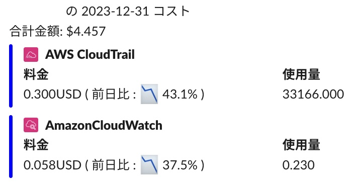

## What is aws_cost_usage
Notify daily cost usage of an AWS account to slack channel.



## How to use this
### Execution
#### Lambda
You can deploy with Terraform resources on your AWS account with AWS Lambda.

```hcl
terraform {
  required_version = "1.6.6"
  required_providers {
    aws = {
      source  = "hashicorp/aws"
      version = "5.31.0"
    }
    github = {
      source  = "integrations/github"
      version = "5.42.0"
    }
  }
}

module "cost" {
  source        = "github.com/tetsuya28/aws_cost_report.git//module"
  name          = "aws-cost-report" # AWS resource name to deploy Lambda, IAM, etc
  slack_channel = "#random"         # Slack channel to notify
  slack_token   = "xoxb-xxx"        # Slack token
  build_version = "v0.1.0"          # default : latest
}
```

#### Others
You can download binary from GitHub Release.

### Support multi languages
- English
  - Set `LANGUAGE=en`
- Japanese
  - Set `LANGUAGE=ja`

## Development
- Init
```
cp .env{.sample,}
```

- Run locally
```
make run
```

## Known issues
### Got daily cost as $0.000
If you set CloudWatch Events Schedule near AM 0:00 in UTC, AWS has not reflect daily cost yet.
So, you need to set the schedule for more later.
